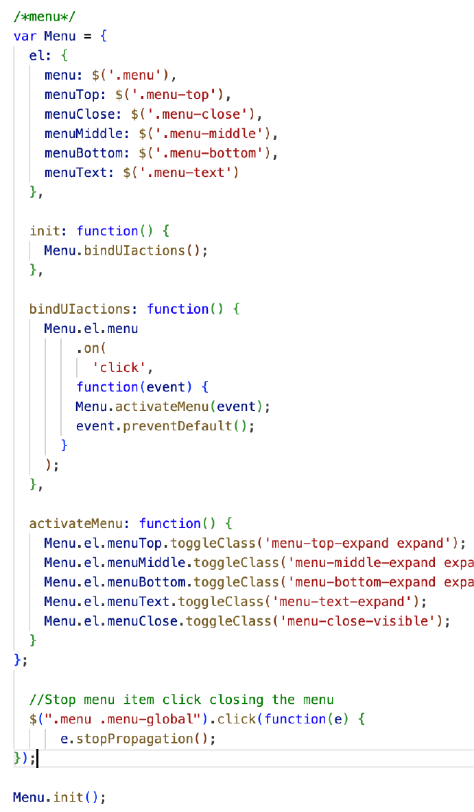
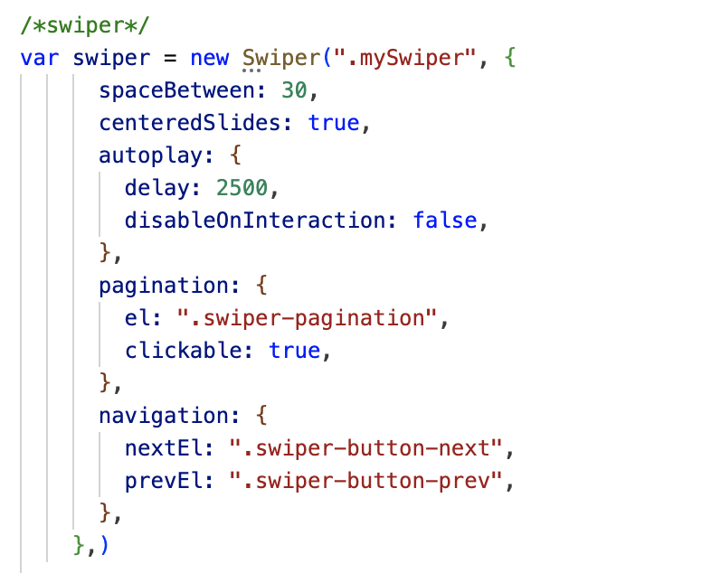
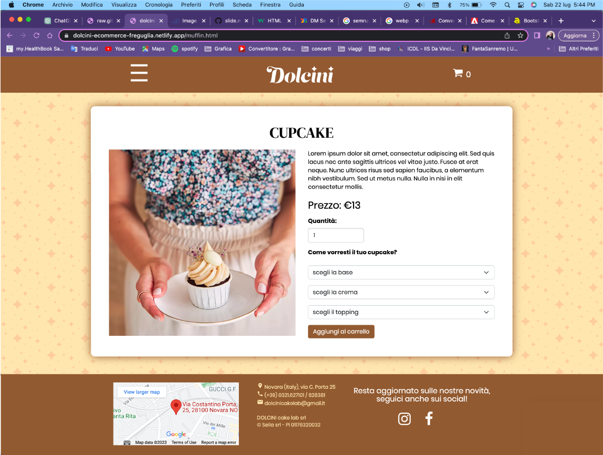
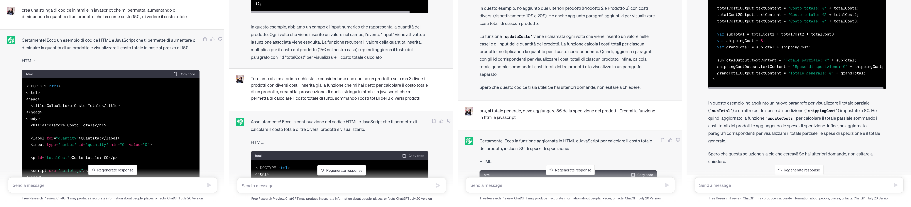
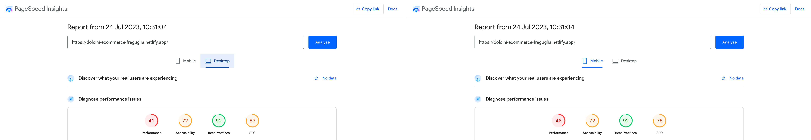

# Presentazione del mio e-commerce

_**CORSO DI WEBDESIGN 2**_
A. A. **2022-2023**
-
Matricola **834**
Docente **Matteo Baccan**

<!-- _paginate: false -->
<!-- _footer: "" -->
<!-- style: "
img[alt~='center'] {
  display: block;
  margin: 0 auto;
}

header{
  font-family: 'DM Serif Display', serif;
}
" -->

---

## Aree di lavoro

Per questo progetto ho creato un sito e-commerce sulla vendita di dolci, composto da
**4 pagine collegate tra di loro:** 
- Home
- Pagina prodotto
- Carrello
- About us

Queste pagine sono accomunate da una **headline** e da un **footer** ricorrenti in ogni pagina.

---

# Strumenti usati

Per programmare le varie pagine di questo sito mi sono affidata a **Codespace**, l'ambiente di sviluppo gratuito di **Github**   basato sul cloud che consente agli sviluppatori di creare, testare e distribuire le loro applicazionidirettamente dalla piattaforma GitHub.

CodeSpace **semplifica e accelera il processo di sviluppo** delle applicazioni e **promuove la collaborazione tra gli sviluppatori** all'interno della piattaforma GitHub.

---
# Strumenti usati

Per vedere l'anteprima del mio sito, ho collegato il mio repository a questo link di netlify: https://github.com/ottafregu/ecommerce-freguglia-dolcini

**Netlify** è una società di cloud _computing remote-first_ che offre una piattaforma di sviluppo che include build, deployment e servizi di back-end serverless per applicazioni Web e siti Web dinamici. La piattaforma è costruita su standard web aperti, rendendo possibile l'integrazione di strumenti di compilazione, framework web, API e varie tecnologie web in un flusso di lavoro unificato per gli sviluppatori.

---

# Strumenti usati
Per la creazione di alcune parti del mio sito, ho utilizzato **Bootstrap**, in modo da aiutarmi a gestire in maniera più responsive gli spazi.
Bootstrap è un framework di sviluppo web gratuito e open source, progettato per facilitare il processo di sviluppo web di siti responsive e mobile-first, fornendo una raccolta di sintassi per i modelli di progettazione.

---

# Elementi comuni

_Headline & Footer_

---

## Headline

Nella parte sinistra della headline troviamo un **menù a comparsa** che, al click sulle tre lineette, richiama l'evento 'activateMenu', permettendo così alle 3 fasce '.menu-top', '.menu-middle' e '.menu-bottom' di espandersi e rendendo così visibile sia il loro link interno '.menu-text', sia la X '.menu-close' per chiudere l'intero menù e farlo tornare alla forma iniziale.

---

## Headline
Codice in js del menu

---

## Headline

Al centro della headline troviamo il **logo del brand** che funge anche da collegamento alla home del sito, lavorando come se fosse un link.

---

## Headline

Nella parte destra della headline troviamo il **carrello** in cui, grazie alla funzione 'aggiungiAlCarrello' e 'rimuoviDalCarrello', associate ai tasti presenti sotto ai box prodotti, possiamo vedere il numero di questi inseritovi dentro.
Inoltre, questa icona funge da collegamento alla pagina del carrello stesso.

---

## Footer

Nel footer troviamo la mappa, i contatti e i social: **tre elementi inline** che, allo stringersi della pagina, si posizionano uno sotto l'altro grazie ad una **media query**.

---

# Pagine singole

_Home - Prodotto - Carrello - About us_

---

## Home page

Nella home page troviamo uno slider, un titolo e le tre caselle prodotto.
- Lo slider, cui codice nativo è stato preso da https://swiperjs.com/, contiene 6 immagini di dolci che scorrono una dopo l'altra grazie alla funzione Javascript 'autoplay'.

---
## Home page
Codice in js dello slider

---

## Home page

- Sotto allo slider vi è un titlo che funziona da collegamento con un'ancora interna alla pagina, posizionata appena sopra, che permette al click sulla scritta di far salire la pagina, in modo da rendere visibili le tre caselle prodotto.

---

## Home page

- Sotto alla scitta ci sono le tre caselle prodotto che, usando la class 'card h-100', contengono l'immagine del prodotto, il suo nome, la descrizione, il costo e i tasti collegati al carrello per aggiungere o togliere quantità.

Al passaggio del puntatore sulle immagini dei prodotti, queste diminuiscono l'opacità e si crea un'ombra marrone attorno ad esse. Cliccandoci su invece, si viene reindirizzati alla pagine del prodotto stesso.

---

## Pagina prodotto 

Nella pagina prodotto troviamo un container fluido di boostrap, contenente due colonne in cui è inserita nuovamente la foto del prodotto e le informazioni a riguardo.

Il box si presenta bianco con un'ombra marrone all'esterno; nella parte delle informazioni sono presenti dei menù a tendina il cui codice nativo è stato preso da https://getbootstrap.com/, che permettono di scegliere quella che sarà la personalizzazione del prodotto.

---

## Uso dell'Ai nel Carrello

ChatGPT mi ha aiutata nella creazione del codice per poter far funzionare i calcoli all'interno del carrello.

---

## Carrello 

Cliccando nella parte di menù riguardante o nell'icona in alto a destra, veniamo rimandati alla pagina carrello. Qui troviamo sempre un container fluido come prima, ma con più righe e colonne.
Al suo interno sono riportati l'immagine del prodotto, il suo costo e la quantità che desideriamo (grazie ad una casella di testo editabile), il prezzo totale e la presenza o meno di personalizzazioni.

---

## Carrello

Aumentando la quantità di prodotto desiderato, si attiverà una funzione di calcolo 'updateCosts' che aggiornernerà il costo totale del prodotto moltiplicando il costo base per la quantità inserita.
Inoltre, sommerà i costi totali dei vari prodotti presenti nel carrello per avere un subtotale 'subTotal', visibile nella riga **Totale prodotti**, per poi aggiungergli i costi di spedizione 'shippingCost' e aggiornare così il costo totale 'grandTotal' visibile nella riga **Totale**.

---

## Carrello
Codice in js del carrello

---

## About us 

Il corpo della pagina _**chi siamo**_ è diviso in 3 grandi fasce, riconoscibili dal distacco delle immagini di sfondo che ricoprono la larghezza dell'intera fascia:
- Nella prima troviamo un titolo in alto al centro e un box con testo posizionato basso al centro, grazie al tag "vertical-align: bottom"

---

## About us 

- Nella seconda troviamo un box con opacità dell'80%, posizionato in alto a sinistra e contenente sia un titolo h2 che un testo
- Nella terza troviamo un box posizionato al centro e contenente del testo, con al di sotto un bottone di rimando alla homepage.

---
# Responsive delle pagine

_Adattmenti creati grazie alle **media query**_

---

**SCHERMI MOLTO GRANDI**
Più grandi di **1200px**

---

**SCHERMI GRANDI**
Compresi tra **992px e 1200px**

---

**SCHERMI MEDI**
Compresi tra **768px e 992px**

---

**SCHERMI MEDIO-PICCOLI**
Compresi tra **576px e 768px**

---

## Immagini

Tutte le immagini presenti in questo sito sono state convertite in formato **.webp** dal sito https://anyconv.com/it/ .
Questo perchè il formato .webp è un **tipo di file per immagini raster sviluppato da Google** che utilizza un algoritmo di compressione avanzato, chiamato VP8 o VP9, che permette di ottenere **dimensioni di file più piccole** rispetto ad altri formati comunemente utilizzati, come il .jpeg o il .png, **mantenendo la qualità visiva dell'immagine.**

In sintesi, la scelta di utilizzare il formato .webp per le immagini del mio sito web mi ha consentito di **migliorare le prestazioni** complessive del sito e di offrire un'**esperienza più veloce e piacevole** ai visitatori.

---

# Prestazioni

PageSpeed Insights https://pagespeed.web.dev/ è uno strumento gratuito di Google che permette di misurare la velocità di caricamento di una pagina web e le sue prestazioni.

